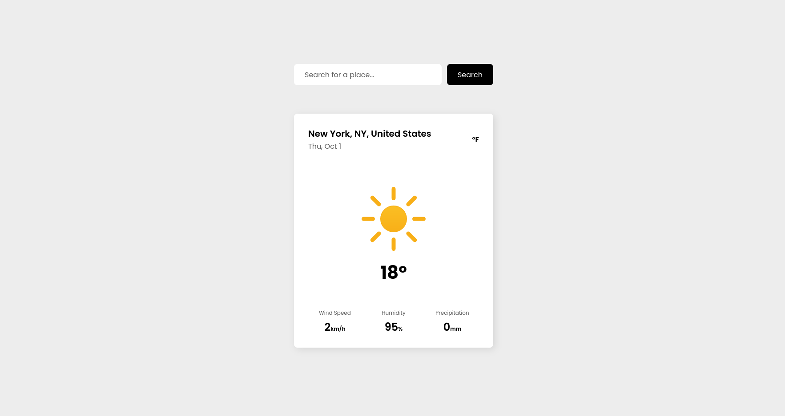

# Weather App - The Odin Project

This is a solution to the [Weather App project on The Odin Project](https://www.theodinproject.com/lessons/node-path-javascript-weather-app).

## Table of contents

- [Overview](#overview)
    - [The solution](#the-solution)
    - [Screenshot](#screenshot)
    - [Links](#links)
- [My process](#my-process)
    - [Built with](#built-with)

## Overview

### The solution

Users should be able to:

- Search for weather information for a particular location.
- View current weather conditions, including temperature, weather icon, and location details.
- Switch between specific temperature units (Celsius and Fahrenheit).
- View the optimal layout for the interface depending on their device's screen size.
- View hover and focus states for all interactive elements on the page.

### Screenshot

### Links

- Live Site URL: [Here!](https://mohamed-devp.github.io/odin-weather-app/)

## My process

### Built with

- CSS custom properties
- Flexbox
- CSS Grid
- Mobile-first workflow
- [Webpack](https://webpack.js.org/) - JS Bundler
- [Meteocons](https://meteocons.com/) - For Weather Icons
